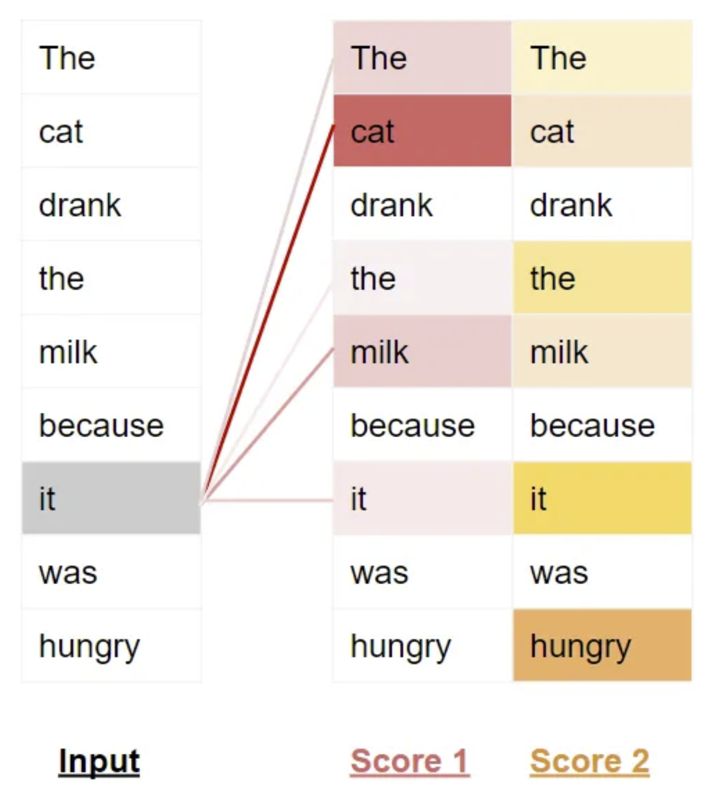
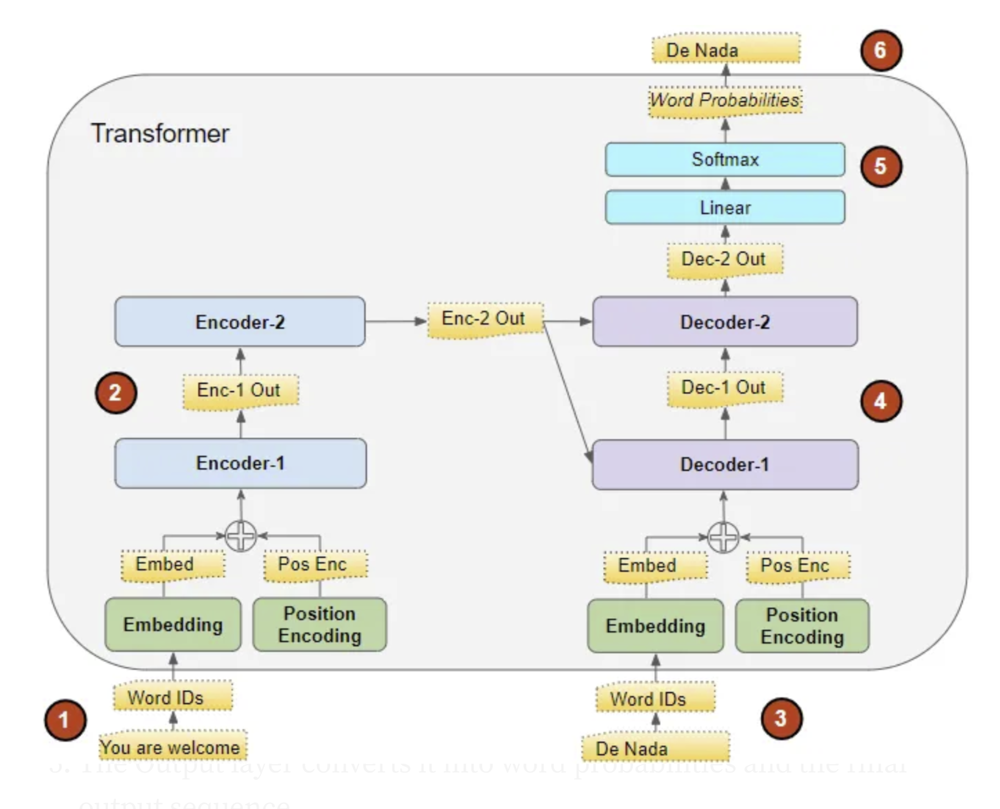
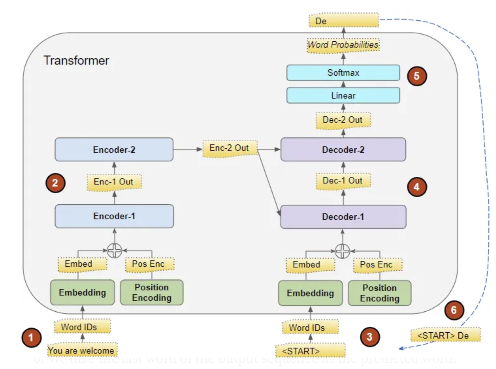
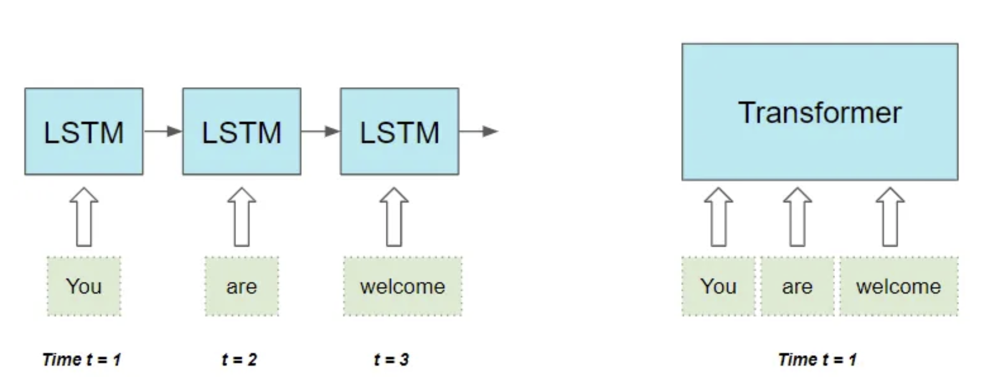

# Transformers Explained Visually (Part 1): Overview of Functionality[1]

## Fundamentals

- The Transformer excels at handling `text data` which is inherently sequential 
- Input / Output: `Text Sequence`
- The Transformer entails `Encoder stack` and `Decoder stack`, which both have the `Embedding layers` at the input
*NOTE:* Some Transformer architectures have no `Decoder` and rely only on the `Encoder`
- `Attention` is the core of the Transformer

(Image Retrieved from [1])

## Attention

- When processing a word, Attention enables the model to focus on other words that are closely related to that word
- `Self-Attention` relates every word to every other word in the input sequence
- Transformers include multiple `attention scores` for each word

(Image Retrieved from [1])

## Transformer Training vs Inference 

- The Transformer works slightly differently during `Training` and `Inference`

| Training        | Inference        |
| -----------  | -----------  |
|  |  |
| **Goal:** Learn how to output the target sequence, by using both input and target sequences | **Goal:** Produce the target sequence from the input sequence alone |
| `Teacher Forcing` is involved to avoid compounding the errors and speed up the training | Loop the generated output and feed the **output sequence** to the `Decoder` in the next timestep |

(Images Retrieved from [1])

## RNN vs CNN vs Transformer

| RNN        | CNN        | Transformer        |
| -----------  | -----------  | -----------  |
| Hard to handle long-range dependencies between words that are spread far apart in a long sentence | Only parts of the image that are close enough to fit within the kernel size can interact with each other. For items that are further apart, a deeper network will be needed |Distance between words in the input sequence does not matter |
| Process the sequence sequentially one word at a time, thus slowing down the traning and inference |  | Process all the words in the sequence in parallel, thus speeding up computation |

(Image Retrieved from [1])

## References
[1] K. Doshi, “Transformers Explained Visually (Part 1): Overview of Functionality,” Medium, Jun. 03, 2021. https://towardsdatascience.com/transformers-explained-visually-part-1-overview-of-functionality-95a6dd460452
