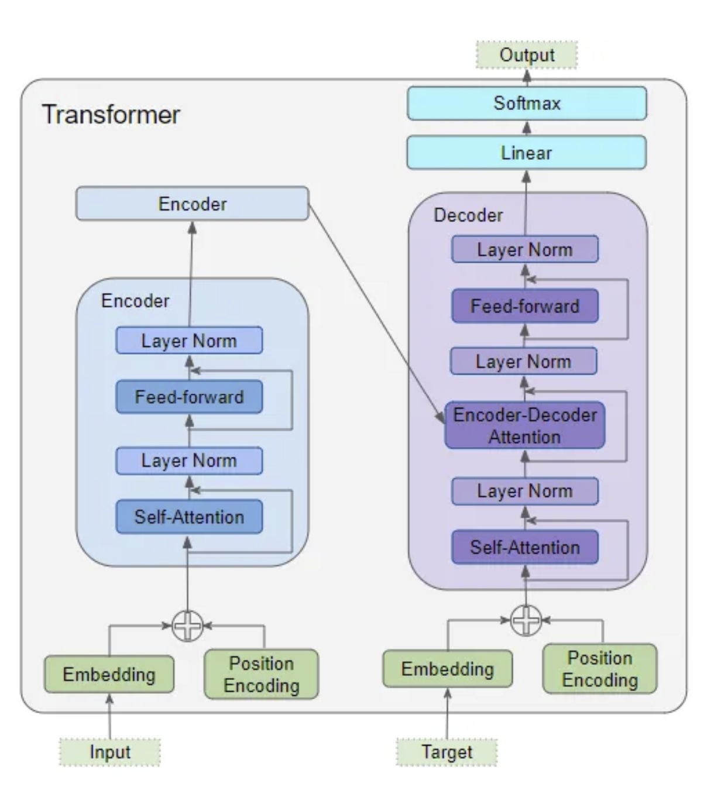
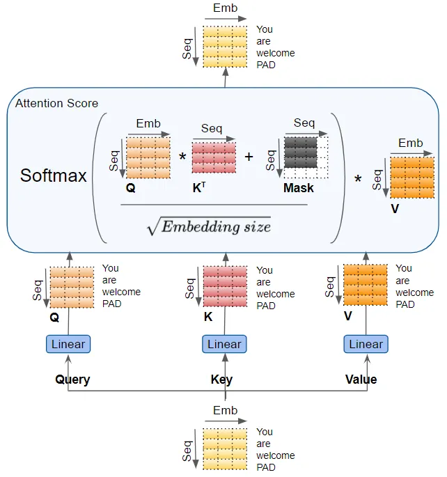

# Transformers Explained Visually (Part 2): How it works, step-by-step[1]

## Transformer Architecture

(Image Retrieved from [1])

## Before Embedding

- The text sequence is mapped into `numeric word IDs` through the `Tokenizer`

## Embedding

- The `embedding` layer maps each input word into an `embedding vector`, which is a riched representation of the meaning of that word
- `Transformer` needs two things about each word -- *the meaning of the word* and *the position of that word in the sequence*.
    - `RNN` implements a loop where each word is input sequentially, it implicitly knows the position of each word
- The `Embedding layer` encodes the *meaning of the word*, whereas the `Position Encoding layer` encodes the *position of the word*
- The two encoded features is added together before feeding into the `Encoder` or `Decoder`
- Both `Embedding layer` and `Position Encoding layer` generate feature in 3D matrix with dimension of `(number of samples, sequence length, embedding size)`. And this shape is preserved all through the `Transformer` until it is reshaped by the `final Output layer`

## Attention

- **Self-attention in the Encoder and Decoder**: the `input sequence` and `target sequence` pay attention to itself
- **Encoder-Decoder-attention in the Decoder**: the `target sequence` pays attention to the `input sequence`
- The `Attention layer` takes the input in the form of three parameters: `Query`, `Key`, and `Value`, which carry an encoded representation of each word in the sequence
- There are multiple `linear layers`/ `linear head` to generate multiple `attention scores`. The computation of the `attention scores` is based on the formula below:

(Image Retrieved from [1])

## Attention Masks

The `attention masks` serve in two ways:
- **In the Encoder Self-attention and in the Encoder-Decoder-attention:** 
    - Zero attention outputs where there is `padding` in the input sentences
    - Ensure the padding does not contribute to the self-attention
- **In the Decoder Self-attention:** 
    - Prevent the decoder from peeking ahead at the rest of the `target sequence` when predicting the next word

## Linear & Softmax

- `Linear layer`: Project the decoded vector into `scores` / `logits`, with a value for each unique word in the traget vocabulary
- `Softmax layer`: Turn the `logits` into `probabilities` (which add up to 1)

## References
[1] K. Doshi, “Transformers Explained Visually (Part 2): How it works, step-by-step,” Medium, Jun. 03, 2021. https://towardsdatascience.com/transformers-explained-visually-part-2-how-it-works-step-by-step-b49fa4a64f34
