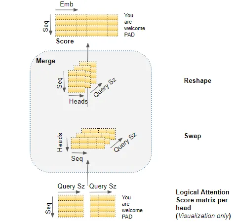

# Transformers Explained Visually (Part 3) Multi-head Attention, deep dive[1]

## Attention Layer

- **Self-attention in the Encoder / Decoder**
    - The encoded representation of each word in the `input sequence` / `target sequence`, which captures the meaning and position of each word, is the input of `Query`, `Key`, `Value` in the `Self-attention` in the first `Encoder` / `Decoder`
    - The output from the `Self-attention` in the first `Encoder` / `Decoder` entails an encoded representation for each word in the `input sequence` / `target sequence`, along with the `attention score` for each word
- **Encoder-Decoder-attention in the Decoder**: 
    - Generate a representation of both the `input sequence` and `target sequence` 
    - Produce `attention scores` for each `target sequence` word, which also captures the influence of the `attention scores` from the `input sequence`

## Attention Hyperparameters

- `Embedding Size`
- `Query Size` (which is equal to `Key Size` and `Value Size`)
- `Number of Attention Heads`
- `Batch Size`

## Multiple Attention Heads

- Multiple Attention Heads empower transformer to encoder multiple relationships and nuances for each word
    - Due to the `logicall split`, separate sections of `Embedding` can learn different aspects of the meanings of the word, thereby allowing the transformer to capture richer representation of the sequence
- The Attention module repeats its computations multiple times in parallel across `Query`, `Key`, and `Value` branches
- The weights of `Query`, `Key`, and `Value` share the same `linear layer` but are `logically splitted`
    - The `logical split` enables the `linear layer` to operate on their own logical section of the data matrix for `Query`, `Key`, and `Value` respectively
    - The `logical split` is done by choosing the `Query Size`, where *Query Size = Embedding Size / Number of Heads*
- Merging the multiple attention heads consists of two steps:
    - Reshape the Attention Score matrix from `(Batch Size, Number of Head, Length of Sequence, Query Size)` to `(Batch Size, Length of Sequence, Number of Head, Query Size)`
    - Collapse the Head dimension by reshaping to `(Batch Size, Length of Sequence, Number of Head * Query Size)` which is also known as `(Batch Size, Length of Sequence, Embedding Size)`

(Image Retrieved from [1])

## End-to-end Multi-head Attention

(Image Retrieved from [1])

## References
[1] K. Doshi, “Transformers Explained Visually (Part 3): Multi-head Attention, deep dive,” Medium, Jun. 03, 2021. https://towardsdatascience.com/transformers-explained-visually-part-3-multi-head-attention-deep-dive-1c1ff1024853
