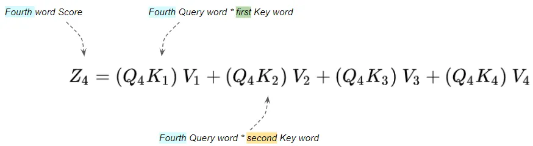
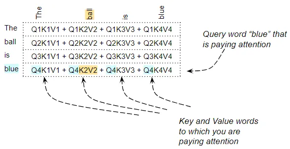

# Transformers Explained Visually (Part 4): Not Just How, but Why They Work So Well[1]

## What we want for the Transformer

- We want the `attention score` to be high for words that are relevant in the sentence
- We want the `attention score` to be low for words that are unrelated in the sentence
- Based on the two objectives above, the transformer learns the weights of `embedding`, `position encoding` and `linear layer`, thereby generating the `word vectors` are more aligned if the words are relevant

## Why the Attention Module has Query, Key, and Value

- Enable the `Attention Module` to gain more parameters that is able to tune the creating of the `word vectors`

## Query, Key, and Value

| Item        | Notion        | Interpretation        |
| -----------  | -----------  | -----------  |
| `Query` | Query value of the `Query Word` | The word for which we are calculating `Attention` |
| `Key` | Key value of the `Key Word` | The word to which we are paying `Attention` |
| `Value` | Encoded value of every `Key Word` | The word to which we are paying `Attention`  |

(Image Retrieved from [1])

## Attention Score Matrix

- Each row corresponds to one word in the source sequence

*NOTE:* The image below sets the `embedding size` to be 1

(Image Retrieved from [1])

## References
[1] K. Doshi, “Transformers Explained Visually — Not just how, but Why they work so well,” Medium, Jun. 08, 2021. https://towardsdatascience.com/transformers-explained-visually-not-just-how-but-why-they-work-so-well-d840bd61a9d3
