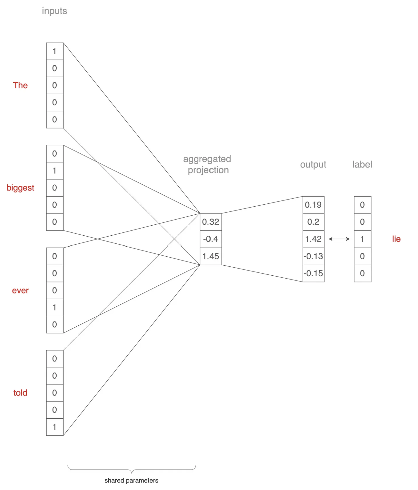
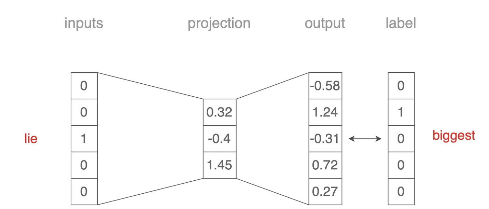
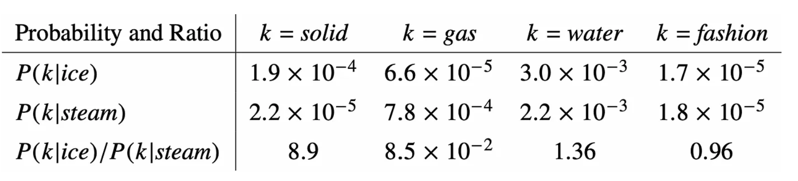

# Word2Vec, GloVe, and FastText, Explained[1]

## Word2Vec

- Help computer understand words and their meanings through `embeddings`
- `Embeddings` are mathematical vectors representing words numerically
- Encode word meanings into continuous dense vectors

### Continuous Bag-of-Words (CBoW) & Skip-gram 

- Two main architectures within `Word2Vec`

| Continuous Bag-of-Words (CBoW)        | Skip-gram        |
| -----------  | -----------  |
|  |  |
| Predict the target word based on its surrounding word | Predict the context word given an input word |

(Image Retrieved from [1])

### Pros & Cons

| Pros        | Cons        |
| -----------  | -----------  |
| Overcome the `curse of dimensionality` with simplicity | Limited preservation of global information |
| Generates vectors such that words closer in meaning have closer vector values | Less suitable for `morphologically rich languages` |
| Pretrained embeddings for various NLP applications | Lack of `broad context awareness` |
| Self-supervised framework for data augmentation and training |  |

## GloVe: Global Vectors

- `GloVe` capitalizes global contexts by leveraging `word-word co-occurrence`
- `Word2Vec` works directly with the probabilities of co-occurrence, `GloVe` focuses on the ratios of co-occurrence probabilities

- Take the following table as an example:
    - If the ratio is much greater than 1, it indicates a stronger association with *ice*
    - If the ratio is much greater than 0, it indicates a stronger association with *steam*
    - A ratio closer to 1 implies no clear association with either *ice* or *steam*

(Image Retrieved from [1])

## FastText

- Effectively handle languages that are morphologically rich
- `Word2Vec` treats each word as a whole, whereas `FastText` is able to break down words into character n-grams and generate word vectors that account for different forms and variations.

## Context Awareness

- `Word2Vec` generates the same vector representation for a given word, regardless of its context. Bringing in `LSTM` or `transformer-based model` can generate word representations that vary based on its context, accommodating the nuanced meanings of word in different scenarios.

For example, the word *queen* has different meanings in the two sentences below:

1. “That drag queen slays.”
2. “She has an ace and queen for a perfect hand.”

In `Word2Vec`, the vectors for *queen* in both cases would be the same. `LSTM` or `transformer-based model` can incorporate contextual information into word representations

## References
[1] Ajay Halthor, “Word2Vec, GloVe, and FastText, Explained - Towards Data Science,” Medium, Jun. 20, 2023. https://towardsdatascience.com/word2vec-glove-and-fasttext-explained-215a5cd4c06f (accessed Jun. 23, 2023).
