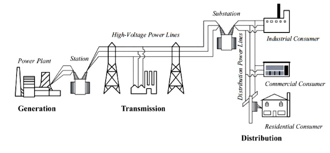

# Chapter 1. System Overview, Terminology, and Basic Concepts

## System Overview
- Electric power systems are real-time energy delivery system, instead of storage system.

(Image Retrieved from [1])

## Terminology

- **Voltage**: Potential energy source in an electrical circuit to make things happen
    - A.k.a. Electromotive Force (EMF)
    - Voltage always tries to push or pull current
    - The `potential energy` of the voltage source is converted into the `kinetic energy` as the electrons flow.
- **Current**: The flow of `electrons` in a conductor
    - The flow of electrons in a conductor produces heat from the conductor's resistance (i.e. friction)
- **Power**: The product of voltage and current
- **Energy**: The product of electrical power and time

## Three Physical Laws

These three physical laws describe how electric power system work.

- **Faraday's Law**: A voltage is produced on any conductor in a changing magnetic field.
- **Ampere's Law**: A curent flowing in a conductor produces a magnetic field around it.
- **Lenz's Law**: An induced electric current flows in a direction such that the current opposes the change that induced it.

## Three Types of Electrical Load

### Resistive Load

- Causing friction and reducing the amount of current flow
- Producing heat or light

### Inductive Load

- Require a `magnetic field` to operate
- Store energy in the form of `magnetic field`
- **Inductance**: The tendency to oppose a change in the electric current flowing through the conductor
- Current in an inductive load **lags** the applied voltage
    - Due to the induced voltage (i.e., Back EMF) opposing the current flow through the coil
- Short circuit in DC current

### Capacitive Load

- A device made of two metal conductors separated by an insulator called a `dielectric`
- **Capacitance**: The capability to store electric charge
- Current associated with capacitors **leads** the voltage
    - Since it takes time to charge up the dielectric material to full voltage from the charging current
- Open circuit in DC current

> Inductors have positive VARs and capacitors have negative VARs

> As a general rule, capacitive loads are not items that people purchase at the store in massive quantities like they do resistive and inductive loads. For that reason, power companies install capacitors on their power systems on a regular basis to maintain a reactive power balance with the typically high inductive demand.

    
## Reference

[1] “Basic Electric Power and Structure of Power System,” BrainKart. https://www.brainkart.com/article/Basic-Electric-Power-and-Structure-of-Power-System_12339/
