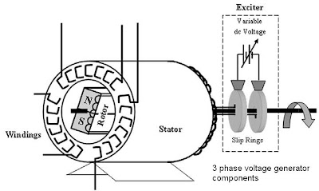
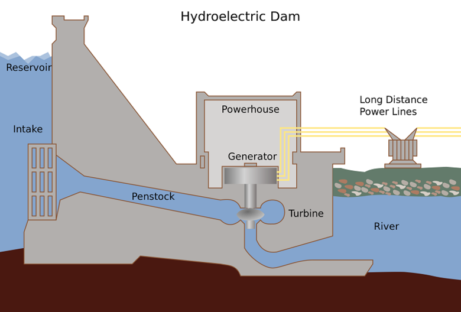

# Chapter 2. Generation

## Generator Components

- **Stator**: The `windings` mounted on the stationary part of the generator
- **Rotor**: The center component that when turned moves the magnetic field (i.e., shaft with `permanent magnet` or `electromagnet`)
- **Exciter**: The voltage source to the rotor that creates the rotor's magnetic field

(Image Retrieved from [1])

## Steam Turbine Generator (STG)

- Convert the steam's energy into the rotational energy of a shaft.
    - The steam is boiled from water via heating and condensed into cooling water in `reservoir`
    - The cooling water will be recycled into superheated steam, thereby a close loop is formed
- Given the operation of the `exciter`, the rotational shaft is changing the magnetic field and generate voltage/current in the windings, which is the electric energy

## Conventional Generation Plants

- **Fossil Fuel Power Plants**
    - Burning the fossil fuel (coal, gas, oil) to generate heat boiling the water into steam
- **Nuclear Power Plants**
    - Utilize the heat emitted from `nuclear reaction` to produce steam energy
-** Combustion Turbine Generation Plants**
    - Burning fuel in a jet engine (diesel, natural gas) and use the hot exhaust gases to spin an STG

## Renewable Energy Resources

- **Hydro Power Plants**
    - Capture the energy of moving water

(Image Retrieved from [2])

- **Wind Turbine Generators**
- **Reflective Solar Power Plant**
    - Also called **Concentraing Solar Power (CSP)**
- **Solar Direct Geneartion**
    - Also called **Photovoltaic (PV)**
- **Geothermal Power Plants**
- **Biopower**
    - Come primarily from wood and agricultural residues

## Reference

[1] D. M. Electrical, “three phase power generator,” http://electrical-engineering-course.blogspot.com/. https://electrical-engineering-course.blogspot.com/2011/06/three-phase-power-generator.html (accessed Oct. 30, 2023).

[2] Energy Education, “Hydroelectric facility - Energy Education,” Energyeducation.ca, 2018. https://energyeducation.ca/encyclopedia/Hydroelectric_facility
