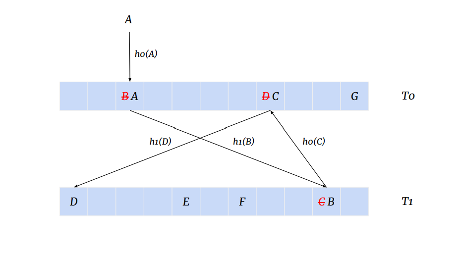
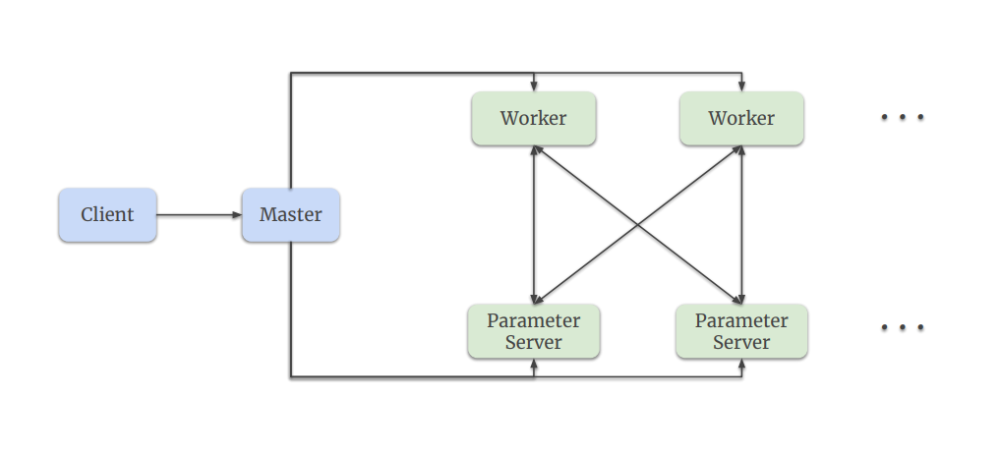
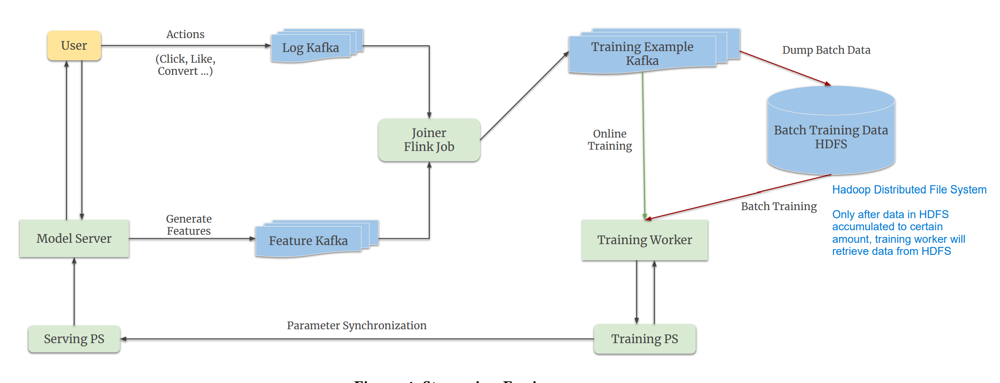
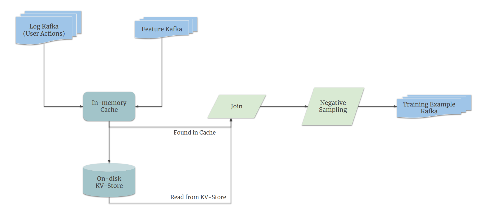

# Monolith Real Time Recommendation System With Collisionless Embedding Table[1]

## Limitations & Contributions

The ubiquitous deep learning frameworks, such as TensorFlow or PyTorch, fall short of business demands in recommendation scenarios, because:
- Tweaking systems based on static parameters and dense computations is detrimental to model quality.
- Those framewors completely separate batch-training stage and serving stage. 

- Present a recommendation model named `Monolith` which is tailored for online training.
- Craft a collisionless embedding table which has `Cuckoo Hashmap` under the hood.
- Provide a production-ready online training architecture with high fault-tolerance.

## Challenges & Solutions

- The data features are mostly sparse, categorical, and dynamically changing
- The underlying distribution of training data is non-stationary (`Concept Drift`)

To mitigate those challenges, serving models need to be updated from new user feedback as close to real-time as possible to reflect the latest interest of a user, and
- Provide full expressive power for sparse features via a **collisionless hash table** and a **dynamic feature eviction** mechanism.
- Loop serving feedback back to training in real-time with online training.

## Cuckoo Hashmap

A collisionless hashtable for storing sparse parameters.
- **Dense Parameters**: Weights/Variables in a deep neural network.
- **Parse Parameters**: Embedding tables that correspond to sparse features.

Essentially, this structure has two hashtables $T_{0}$ and $T_{1}$ with different hash functions $h_{0}(x)$ and $h_{1}(x)$.

When trying to insert an element A into $T_{0}$, it first attempts to place A at $h_{0}(A)$; If $h_{0}(A)$ is occupied by another element B, it would evict B from $T_{0}$ and try inserting B into $T_{1}$ with the same logic.

(Image Retrieved from [1])

To avoid massive memory footprint, the authors remove the IDs with low occurrences and stale IDs with threshold values of occurrences and expire time respectively.

## Worker-PS Architecture

- **Worker Machine**: Perform computations as defined by the `TensorFlow` graph.
- **PS (Parameter Server) Machine**: Store and update parameters per the gradients computed by the **Worker**.

(Image Retrieved from [1]) 

## Model Architecture

`Monolith` is a closed-loop model and capable of seamlessly switching between `batch training` and `online training`

(Image Retrieved from [1])

Two `Kafka queues` is used to store log actions of user and features respectively.

If all features are kept in `in-memory cache`, it would simply not fit it memory. Hence, an `on-disk key-value storage` is utilized to store features that are waiting for over certain time period.

(Image Retrieved from [1])

The `sync schedule` for `sparse parameters` is aggressive, while updating `dense parameters` is less frequent (day-level, at midnight when the traffic is lowest), which brings down the computation overhead to a very low level. 

***
## Batch Training vs Online Training

- **Batch Training**: Useful for training historical data when we modify our model architecture and retrain the model.
- **Online Training**: The model interactively update and adapt itself according to users' feedback in realtime through consuming realtime data on-the-fly.

## References
[1] Liu, Z., Zou, L., Zou, X., Wang, C., Zhang, B., Tang, D., Zhu, B., Zhu, Y., Wu, P., Wang, K. Cheng, Y. Monolith: Real Time Recommendation System With Collisionless Embedding Table.  (2022)

