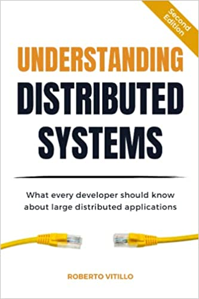

# Understanding Distributed Systems, Second Edition: What every developer should know about large distributed applications

(Image Retrieved from [Amazon](https://www.amazon.ca/Understanding-Distributed-Systems-Second-applications/dp/1838430210/ref=sr_1_1?keywords=understanding+distributed+systems&qid=1676247627&sprefix=understanding+dis%2Caps%2C177&sr=8-1)

| Chapter | Description |
| ---------------------- | ---------------------- |
| [1. Introduction](Chapter_01_Introduction.md) | Introduce some basic concepts regarind distributed systems |
