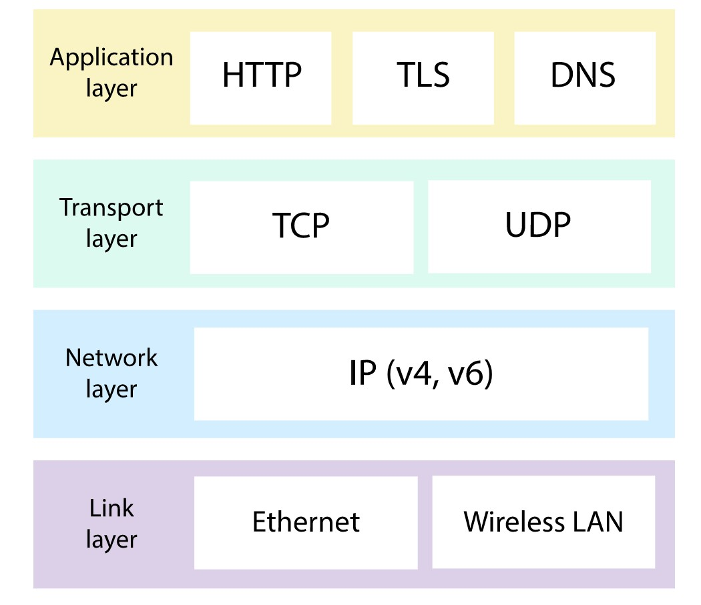
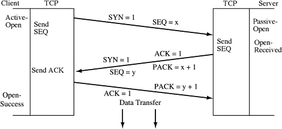

# Part I. Communication

> Communication between processes over the network is at the heart of distributed systems

## Network Protocols

- Network protocols determine how data is processed and formatted. 
- The protocols are arranged in a stack, where each layer is built on the abstraction provided by the layer below.
- Lower layer is closer to the hardware.

(Image Retrieved from [1])

## Reliable Links - `Transmission Control Protocol (TCP)`

- IP does not guarantee the data sent over the internet will arrive at its destination, whereas TCP does.
- TCP partitions a byte stream into discrete packets called `segments`. And the receiver uses a checksum to verify the integrity of a delivered segment.
- The operating system manages the connection state on sender and receiver through a `socket`.
    - A network socket is a software structure for sending and receiving data across the network.
    - The properties and structure of a socket are defined by an `application programming interface (API)`.
- TCP uses `Three-way handshake` to establish a new connection

(Image Retrieved from [2])

- The processes typically maintain connection pools to recreate connections repeatedly
    - This avoids paying the `cold-start tax`
    - This also handles the delayed segments
- At the receiver side, there is a `receiver buffer` that stores the TCP segments waiting to be processed.
    - Knowing hte buffer size from the receiver, the sender avoids sending more data than can fit in the receiver's buffer.
- At the sender side, there is a `congestion window` which refers to the total number of segments that can be sent without acknowledgement from the other side.
    - Bandwidth = Window Size / RTT (Round-trip time)
    - The shorter the RTT, the better the network's bandwidth is utilized. That is why we prefer putting servers geographically close to the clients.
- Limitations of TCP: lower bandwidth and higher latencies.
- Alternative of TCP - `User Datagram Protocol (UDP)`
    - Bootstrap custom protocols which provide some of the stability and reliability guarantess that TCP does.
    - Use case: In gaming snapshot transimission, TCP retransmitts the missing snapshot to the client, which degrades user experience as the game evolves in real-time,but UDP does not.

## Secure Links - `Transport Layer Security (TLS)`

- TLS runs on top of TCP and protects communication channels against interception from a middleman.
- TLS provides `encryption`, `authentication`, `integrity`.
- TLS uses `certificate` to prove the ownership of a public key. The certificate issuing entity is called `certificate authority (CA)`.
- TLS verfies the integrity of the data by calculating a message digest.

## Phone Book of the Internet - `Domain Name Server (DNS)`

- DNS stores the `Domain Name`-`IP Address` pairs.
- Every DNS record has a `time to live (TTL)` that informs the cache how long is the entry valid for.
- The principle that a system should continue to function even when a dependency is impaired is also referred to as `static stability`.

## The Adapter on the Server - `Application Programming Interface (API)`

- Direct communication style - `request-response`.
    - The client sends a `request message` to the server, or technically, the `API endpoint` on the server.
    - The server replies with a `response message`
    - This communication style is similar to a function call but across process boundaries and over the network.
- `HTTP` is a `request-response` protocol that encodes and transports information between a client and a server.

| **HTTP Version**      | **Description** |
| :----: | :----: |
| HTTP 1.1      | Low efficiency. Since a new request cannot be processed until the reponse to the previous one has been recived (a.k.a. `head-of-line blocking` or `HOL blocking`)       |
| HTTP 2   | Enable to multiplex multiple concurrent `request-response` transactions (streams) on the same connection. But a packet loss over the connection blocks all streams.       |
| HTTP 3   | Improved based on HTTP 2. A packet loss only interrupts one stream, not all of them.        |

- A HTTP server hosts `resources`. The resource can be a physical or abstract entity, like a document, an image, or a collection of other resources. `Uniform Resource Locator (URL)` is used to identify a resource by describing its location on the server.
    - *https://www.example.com/products?sort=price*
        - *https* is the `protocol`
        - *www.example.com* is the `hostname`
        - *products* is the `name of the resource`
        - *?sort=price* is the `query string`, it reavels how the service handles the request
    - Generally, in HTTP APIs, `JSON` is used to represent the non-binary resource.

- Request Methods

| **Methods**      | **Description** |
| :----: | :----: |
| POST      | Create a new resource.      |
| GET   | Read / Retrieve a resource.     |
| PUT   | Update a resource.              |
| DELETE   | Delete a resource.           |

- Response Status Code

| **Status Code**      | **Description** |
| :----: | :----: |
| 200 - 299      | Communication success      |
| 300 - 399      | Resource redirection      |
| 400 - 499      | Client errors      |
| 500 - 599      | Server errors      |

- `Idempotency`: A method can be executed multiple times, and the end result should be the same as if it was executed just a single time.
    - An idempotent API makes it easier to implement clients that are robust to failures.

> As a general rule of thumb, APIs should evolve in a backward-compatible way.

> When in doubt, it's helpful to follow the principle of least astonishment.

## References
[1] “The internet protocol suite (article),” Khan Academy. [Online]. Available: https://www.khanacademy.org/computing/computers-and-internet/xcae6f4a7ff015e7d:the-internet/xcae6f4a7ff015e7d:the-internet-protocol-suite/a/the-internet-protocols. [Accessed: 11-Apr-2023]. 

[2] R. Hunt, “Transmission control protocol/internet protocol (TCP/IP),” Encyclopedia of Information Systems, pp. 489–510, 2003. 